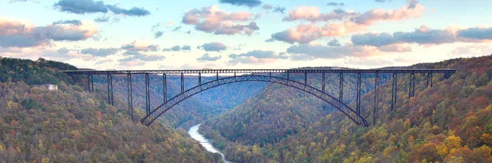
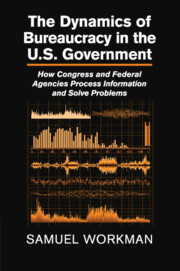

I am an Associate Professor in the Department of Political Science at *The* University *of* Oklahoma. I am also a research faculty member in the National Institute for Risk & Resiliance (NIRR). I specialize in public policy, the bureaucracy, and regulatory politics. I teach courses in public policy, agenda setting, regulatory policy, bureaucracy, and research methods. I am interested in how information is generated in policymaking and governing systems, how information improves resiliency and adaptability of these systems, and connections to policy coherence. My current academic projects examine congressional bureaucracies, the regulatory politics of education policy, and agenda setting in food policy and food systems. See the current projects tab for more details.

I also provide statistical consulting in the private sector, specializing in the grocery floral category. I focus on data-driven decision-making and management, customized reporting and data-informed programming. My projects have focused on market, inventory, and sales analysis, outlier detection and learning, customized dashboards and user interfaces. Email me to discuss your data and statistical needs.

I am originally from Fayette County West Virginia. I enjoy rural life: mountains, rivers, fishing, gardens, and forests.

# Skills & Experience

* Policy research, data management, statistical analysis & modeling, presentation, reporting & data visualization, machine learning
* Project Management, grant writing, team leadership & coordination, public speaking
* Market, sales, and inventory analysis, reporting, and visualization, data-driven decision-making and management
* Languages: R, LaTeX, Beamer, SAS, SPSS, VBA, SQL, Markdown, CSS, HTML (rudimentary)
* Applications: Rstudio, WinEdt, MS Word, MS Excel, MS PowerPoint, SQLite, MS Access

[get my book](https://www.amazon.com/Samuel-Workman/e/B01353W7UE)
--------------------------------------------------------------------------------
